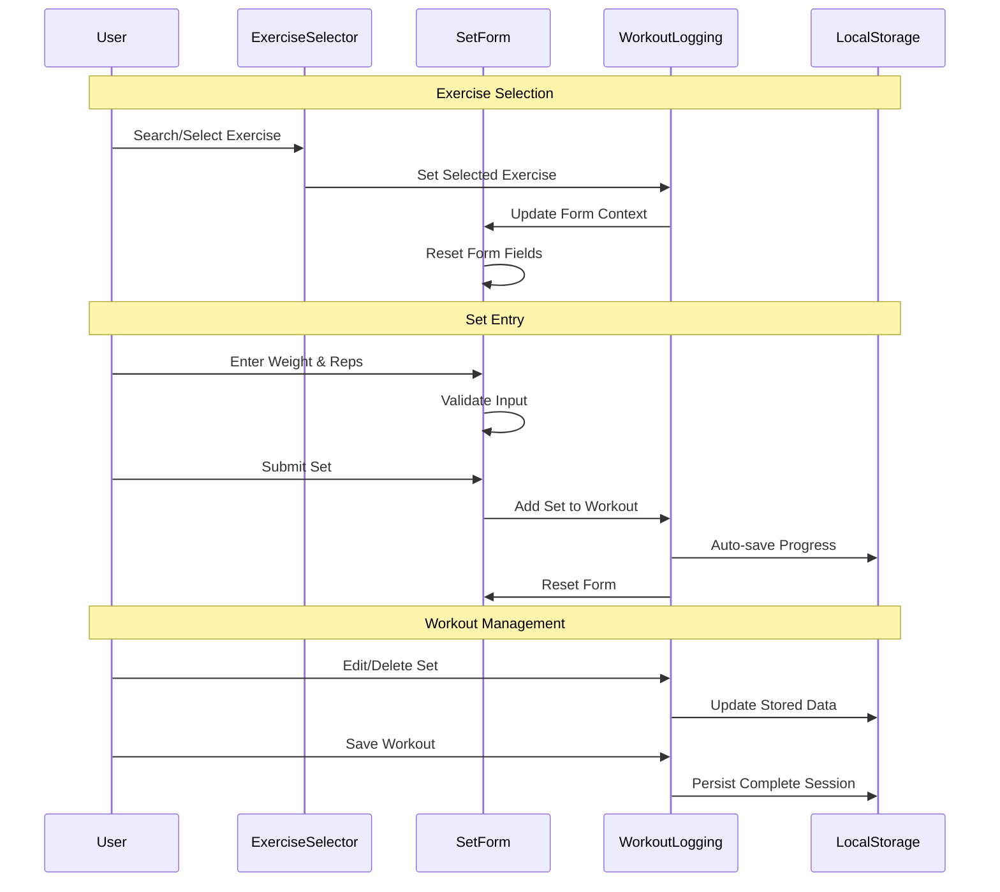

# GT-002 Log Workout Sets - Implementation Planning

## User Story

As a gym user, I want to log my workout sets with specific weights and reps for each exercise, so that I can record my training performance and maintain accurate workout data.

## Pre-conditions

- User has access to the gym tracker application
- Application has a list of exercises available for selection
- User is authenticated and has a valid session
- SQLite database is initialized with proper schema
- Database file permissions are configured for multi-user access

## Design

### Visual Layout

The workout logging interface will feature:
- **Exercise Selection Component**: Dropdown or search interface for choosing exercises
- **Set Logging Form**: Dynamic form for entering weight and reps per set
- **Current Workout Display**: Visual list of logged sets for the current session
- **Unit Selector**: Toggle between lbs/kg weight units
- **Action Buttons**: Add set, edit set, delete set, save workout
- **Confirmation Feedback**: Toast notifications for successful operations

### Color and Typography

- **Background Colors**: 
  - Primary: bg-slate-950 (dashboard background)
  - Cards: dashboard-card class with gradient surface
  - Form inputs: bg-slate-800 border-slate-600

- **Typography**:
  - Page heading: text-3xl font-bold gradient-text
  - Section headers: text-xl font-semibold text-slate-200
  - Form labels: text-sm font-medium text-slate-300
  - Data display: text-lg font-mono text-slate-100

- **Component-Specific**:
  - Exercise cards: performance-tile with hover effects
  - Set entries: stat-card with metric-badge for set numbers
  - Action buttons: btn-primary with success/danger variants
  - Unit toggle: status-badge-active/status-badge-rest

### Interaction Patterns

- **Exercise Selection**: 
  - Search with autocomplete dropdown
  - Click to select with visual feedback
  - Recently used exercises at top

- **Set Entry**:
  - Tab navigation between weight/reps inputs
  - Enter key to add set quickly
  - Real-time validation with error states
  - Auto-focus next input after entry

- **Set Management**:
  - Inline editing on double-click
  - Swipe-to-delete on mobile
  - Drag-to-reorder sets
  - Bulk actions for multiple sets

### Measurements and Spacing

- **Container**:
  ```
  max-w-4xl mx-auto p-6 space-y-8
  ```

- **Component Spacing**:
  ```
  - Form sections: space-y-6
  - Set entries: gap-4
  - Input groups: gap-3
  - Action buttons: gap-2
  ```

### Responsive Behavior

- **Desktop (lg: 1024px+)**:
  ```
  - Two-column layout: exercise selection | set logging
  - Side-by-side weight/reps inputs
  - Horizontal action button groups
  ```

- **Tablet (md: 768px - 1023px)**:
  ```
  - Stacked sections with adequate spacing
  - Grouped input fields
  - Compact button layouts
  ```

- **Mobile (sm: < 768px)**:
  ```
  - Full-width single column
  - Stacked inputs with large touch targets
  - Bottom-fixed action buttons
  ```

## Technical Requirements

### Component Structure

```
src/routes/workouts/
├── log.tsx                       # Main logging page route
└── _components/
    ├── ExerciseSelector.tsx       # Exercise search and selection
    ├── SetEntryForm.tsx          # Weight and reps input form
    ├── CurrentWorkout.tsx        # Display of logged sets
    ├── SetListItem.tsx           # Individual set display component
    ├── UnitSelector.tsx          # Weight unit toggle (lbs/kg)
    ├── WorkoutSummary.tsx        # Summary before saving
    └── useWorkoutLogging.ts      # Custom hook for workout state
src/lib/
├── database/
│   ├── schema.sql               # SQLite database schema
│   ├── migrations/              # Database migration files
│   ├── db.ts                   # Database connection and config
│   └── queries/
│       ├── exercises.ts         # Exercise-related queries
│       ├── workouts.ts         # Workout-related queries
│       └── sets.ts             # Set-related queries
└── types/
    └── database.ts             # Database type definitions
```

### Required Components

- ExerciseSelector ⬜
- SetEntryForm ⬜
- CurrentWorkout ⬜
- SetListItem ⬜
- UnitSelector ⬜
- WorkoutSummary ⬜
- useWorkoutLogging ⬜
- Database Schema ⬜
- Database Connection ⬜
- Query Functions ⬜

### State Management Requirements

```typescript
interface Exercise {
  id: string;
  name: string;
  category: string;
  muscleGroups: string[];
  instructions?: string;
  equipment?: string;
  createdAt: Date;
  updatedAt: Date;
}

interface WorkoutSet {
  id: string;
  workoutId: string;
  exerciseId: string;
  weight: number;
  reps: number;
  restTime?: number;
  notes?: string;
  setNumber: number;
  createdAt: Date;
  updatedAt: Date;
}

interface WorkoutSession {
  id: string;
  userId: string;
  name?: string;
  date: Date;
  startTime: Date;
  endTime?: Date;
  notes?: string;
  createdAt: Date;
  updatedAt: Date;
}

interface User {
  id: string;
  username: string;
  email: string;
  preferences: {
    weightUnit: 'lbs' | 'kg';
    theme: 'light' | 'dark';
  };
  createdAt: Date;
  updatedAt: Date;
}

interface WorkoutLoggingState {
  // UI States
  isLoading: boolean;
  isSaving: boolean;
  selectedExercise: Exercise | null;
  weightUnit: 'lbs' | 'kg';
  
  // Data States
  currentWorkout: WorkoutSession | null;
  currentSets: WorkoutSet[];
  availableExercises: Exercise[];
  recentExercises: Exercise[];
  
  // Form States
  setForm: {
    weight: string;
    reps: string;
    notes: string;
  };
  errors: Record<string, string>;
  hasUnsavedChanges: boolean;
}

// Database Operations
interface DatabaseService {
  // Exercise operations
  getExercises: () => Promise<Exercise[]>;
  getExercisesByCategory: (category: string) => Promise<Exercise[]>;
  searchExercises: (query: string) => Promise<Exercise[]>;
  getRecentExercises: (userId: string, limit: number) => Promise<Exercise[]>;
  
  // Workout operations
  createWorkout: (workout: Omit<WorkoutSession, 'id' | 'createdAt' | 'updatedAt'>) => Promise<WorkoutSession>;
  getWorkout: (workoutId: string) => Promise<WorkoutSession | null>;
  updateWorkout: (workoutId: string, updates: Partial<WorkoutSession>) => Promise<void>;
  deleteWorkout: (workoutId: string) => Promise<void>;
  
  // Set operations
  addSet: (set: Omit<WorkoutSet, 'id' | 'createdAt' | 'updatedAt'>) => Promise<WorkoutSet>;
  updateSet: (setId: string, updates: Partial<WorkoutSet>) => Promise<void>;
  deleteSet: (setId: string) => Promise<void>;
  getWorkoutSets: (workoutId: string) => Promise<WorkoutSet[]>;
  
  // User operations
  getUserPreferences: (userId: string) => Promise<User['preferences']>;
  updateUserPreferences: (userId: string, preferences: Partial<User['preferences']>) => Promise<void>;
}

// State Updates
const actions = {
  selectExercise: (exercise: Exercise) => void;
  addSet: (set: Omit<WorkoutSet, 'id' | 'workoutId' | 'setNumber' | 'createdAt' | 'updatedAt'>) => Promise<void>;
  updateSet: (setId: string, updates: Partial<WorkoutSet>) => Promise<void>;
  deleteSet: (setId: string) => Promise<void>;
  setWeightUnit: (unit: 'lbs' | 'kg') => Promise<void>;
  startWorkout: () => Promise<WorkoutSession>;
  finishWorkout: () => Promise<void>;
  resetForm: () => void;
}
```

## Acceptance Criteria

### Layout & Content

1. Exercise Selection Interface
   ```
   - Search/dropdown for exercise selection
   - Recently used exercises prominently displayed
   - Exercise categories for browsing
   - Clear visual feedback for selected exercise
   ```

2. Set Entry Form
   ```
   - Weight input with unit display
   - Reps input with validation
   - Optional notes field
   - Add set button with loading states
   ```

3. Current Workout Display
   ```
   - List of all logged sets for current session
   - Exercise grouping with set numbers
   - Edit/delete actions for each set
   - Running totals and workout summary
   ```

### Functionality

1. Exercise Management

   - [ ] User can search and select exercises from available list
   - [ ] Recently used exercises appear at top of list
   - [ ] Selected exercise is clearly highlighted
   - [ ] Exercise selection triggers form reset

2. Set Logging

   - [ ] User can input weight with decimal precision
   - [ ] User can input rep count (positive integers only)
   - [ ] Form validates weight and rep ranges (reasonable limits)
   - [ ] User can add multiple sets for same exercise
   - [ ] Sets are immediately visible after adding

3. Data Management
   - [ ] All workout data persists in SQLite database
   - [ ] User can edit previously logged sets with database updates
   - [ ] User can delete incorrect sets with proper cascade handling
   - [ ] Workout session is saved with proper foreign key relationships
   - [ ] Unit conversion between lbs/kg works correctly with user preferences
   - [ ] Database transactions ensure data consistency

### Navigation Rules

- User cannot navigate away with unsaved changes without confirmation
- Form resets after successful set addition
- Exercise selection persists until explicitly changed
- Weight unit preference is saved and restored

### Error Handling

- Display validation errors for invalid weight/rep inputs
- Handle database connection errors gracefully with retry logic
- Implement optimistic updates with rollback on failure
- Show clear error messages for failed database operations
- Provide offline support with local caching and sync when reconnected

## Modified Files

```
src/routes/workouts/
├── log.tsx ⬜
└── _components/
    ├── ExerciseSelector.tsx ⬜
    ├── SetEntryForm.tsx ⬜
    ├── CurrentWorkout.tsx ⬜
    ├── SetListItem.tsx ⬜
    ├── UnitSelector.tsx ⬜
    ├── WorkoutSummary.tsx ⬜
    └── useWorkoutLogging.ts ⬜
├── lib/
│   ├── database/
│   │   ├── schema.sql ⬜
│   │   ├── db.ts ⬜
│   │   ├── migrations/ ⬜
│   │   └── queries/
│   │       ├── exercises.ts ⬜
│   │       ├── workouts.ts ⬜
│   │       └── sets.ts ⬜
│   └── types/
│       ├── workout.ts ⬜
│       └── database.ts ⬜
└── utils/
    ├── workout-helpers.ts ⬜
    └── database-helpers.ts ⬜
```

## Status

🟨 IN PROGRESS

1. Setup & Configuration

   - [ ] Create route structure and navigation
   - [ ] Set up TypeScript interfaces for database entities
   - [ ] Configure SQLite database with proper schema
   - [ ] Set up database migrations and seeding
   - [ ] Configure form validation schemas
   - [ ] Set up database connection pooling for multi-user access

2. Layout Implementation

   - [ ] Create main logging page layout
   - [ ] Implement responsive design patterns
   - [ ] Add dashboard styling components
   - [ ] Create loading and error states

3. Feature Implementation

   - [ ] Build exercise selection component with database queries
   - [ ] Implement set entry form with database persistence
   - [ ] Create workout display components with real-time updates
   - [ ] Add database transaction management
   - [ ] Implement unit conversion with user preference storage
   - [ ] Add offline support with local caching

4. Testing
   - [ ] Unit tests for components and database operations
   - [ ] Integration tests for complete workout flow
   - [ ] Database transaction testing
   - [ ] Multi-user concurrent access testing
   - [ ] Data integrity and validation testing
   - [ ] Accessibility testing

## Dependencies

- SQLite database engine and Node.js driver (better-sqlite3 or sqlite3)
- Database migration tool (custom or third-party)
- Exercise database/list (may need to create initial seed data)
- Form validation library integration (Zod recommended)
- Toast notification system for user feedback
- Connection pooling for concurrent user access

## Related Stories

- GT-001 (User Login Access) - Authentication required
- GT-003 (Browse Exercises by Category) - Exercise selection integration
- GT-004 (Track Progress Over Time) - Data structure compatibility

## Notes

### Technical Considerations

1. **SQLite Database Architecture**: 
   - Use WAL (Write-Ahead Logging) mode for better concurrent access
   - Implement connection pooling to handle multiple simultaneous users
   - Use foreign key constraints to maintain data integrity
   - Implement proper indexing for exercise searches and workout queries

2. **Multi-User File Storage Best Practices**:
   - **Single Database File**: Store one `gymtracker.db` file in application data directory
   - **File Permissions**: Set appropriate read/write permissions (664 on Unix systems)
   - **Concurrent Access**: Use SQLite's built-in locking mechanisms with WAL mode
   - **Backup Strategy**: Implement automated backups to prevent data loss
   - **User Separation**: Use `userId` foreign keys instead of separate database files

3. **Database Location Strategy**:
   ```
   Windows: %APPDATA%/GymTracker/gymtracker.db
   macOS: ~/Library/Application Support/GymTracker/gymtracker.db
   Linux: ~/.local/share/GymTracker/gymtracker.db
   ```

4. **Performance Optimization**: 
   - Use prepared statements to prevent SQL injection and improve performance
   - Implement database connection pooling with proper cleanup
   - Add indexes on frequently queried columns (userId, exerciseId, workoutId)
   - Use transactions for multi-step operations

5. **Data Integrity & Security**:
   - Enable foreign key constraints for referential integrity
   - Use database transactions for atomic operations
   - Implement data validation at both application and database levels
   - Regular database integrity checks with PRAGMA integrity_check

### Business Requirements

- Support for both metric (kg) and imperial (lbs) weight units stored in user preferences
- Reasonable validation ranges (weight: 0.5-1000 lbs, reps: 1-100) enforced at database level
- Data must persist reliably with ACID compliance via SQLite transactions
- Quick entry workflow for users mid-workout with optimistic UI updates
- Multi-user support with proper data isolation and concurrent access handling
- Offline capability with local database that doesn't require server connection

### SQLite Database Schema

#### Database Configuration

```sql
-- Enable foreign key constraints
PRAGMA foreign_keys = ON;

-- Enable WAL mode for better concurrent access
PRAGMA journal_mode = WAL;

-- Set synchronous mode for better performance
PRAGMA synchronous = NORMAL;

-- Set cache size (in KB)
PRAGMA cache_size = 10000;
```

#### Schema Definition

```sql
-- Users table
CREATE TABLE users (
  id TEXT PRIMARY KEY,
  username TEXT UNIQUE NOT NULL,
  email TEXT UNIQUE NOT NULL,
  weight_unit TEXT DEFAULT 'lbs' CHECK(weight_unit IN ('lbs', 'kg')),
  theme TEXT DEFAULT 'dark' CHECK(theme IN ('light', 'dark')),
  created_at DATETIME DEFAULT CURRENT_TIMESTAMP,
  updated_at DATETIME DEFAULT CURRENT_TIMESTAMP
);

-- Exercise categories
CREATE TABLE exercise_categories (
  id TEXT PRIMARY KEY,
  name TEXT UNIQUE NOT NULL,
  description TEXT,
  created_at DATETIME DEFAULT CURRENT_TIMESTAMP
);

-- Exercises table with comprehensive metadata from Free Exercise DB
CREATE TABLE exercises (
  id TEXT PRIMARY KEY, -- Using original exercise ID from Free Exercise DB
  name TEXT NOT NULL,
  category_id TEXT NOT NULL,
  force TEXT, -- push, pull, static, null
  level TEXT, -- beginner, intermediate, advanced, expert
  mechanic TEXT, -- compound, isolation, null
  equipment TEXT, -- barbell, dumbbell, cable, machine, body only, kettlebells, etc.
  primary_muscles TEXT NOT NULL, -- JSON array of primary muscle groups
  secondary_muscles TEXT, -- JSON array of secondary muscle groups
  instructions TEXT, -- JSON array of step-by-step instructions
  images TEXT, -- JSON array of image paths
  created_at DATETIME DEFAULT CURRENT_TIMESTAMP,
  updated_at DATETIME DEFAULT CURRENT_TIMESTAMP,
  FOREIGN KEY (category_id) REFERENCES exercise_categories(id) ON DELETE CASCADE
);

-- Workout sessions
CREATE TABLE workout_sessions (
  id TEXT PRIMARY KEY,
  user_id TEXT NOT NULL,
  name TEXT,
  date DATE NOT NULL,
  start_time DATETIME NOT NULL,
  end_time DATETIME,
  notes TEXT,
  created_at DATETIME DEFAULT CURRENT_TIMESTAMP,
  updated_at DATETIME DEFAULT CURRENT_TIMESTAMP,
  FOREIGN KEY (user_id) REFERENCES users(id) ON DELETE CASCADE
);

-- Workout sets
CREATE TABLE workout_sets (
  id TEXT PRIMARY KEY,
  workout_id TEXT NOT NULL,
  exercise_id TEXT NOT NULL,
  set_number INTEGER NOT NULL,
  weight REAL NOT NULL CHECK(weight > 0),
  reps INTEGER NOT NULL CHECK(reps > 0 AND reps <= 100),
  rest_time INTEGER, -- seconds
  notes TEXT,
  created_at DATETIME DEFAULT CURRENT_TIMESTAMP,
  updated_at DATETIME DEFAULT CURRENT_TIMESTAMP,
  FOREIGN KEY (workout_id) REFERENCES workout_sessions(id) ON DELETE CASCADE,
  FOREIGN KEY (exercise_id) REFERENCES exercises(id) ON DELETE CASCADE,
  UNIQUE(workout_id, exercise_id, set_number)
);

-- Indexes for performance
CREATE INDEX idx_workout_sets_workout_id ON workout_sets(workout_id);
CREATE INDEX idx_workout_sets_exercise_id ON workout_sets(exercise_id);
CREATE INDEX idx_workout_sessions_user_id ON workout_sessions(user_id);
CREATE INDEX idx_workout_sessions_date ON workout_sessions(date);
CREATE INDEX idx_exercises_category_id ON exercises(category_id);
CREATE INDEX idx_exercises_name ON exercises(name);
CREATE INDEX idx_exercises_level ON exercises(level);
CREATE INDEX idx_exercises_equipment ON exercises(equipment);
CREATE INDEX idx_exercises_force ON exercises(force);
CREATE INDEX idx_exercises_mechanic ON exercises(mechanic);

-- Triggers for updated_at timestamps
CREATE TRIGGER update_users_updated_at 
  AFTER UPDATE ON users 
  BEGIN 
    UPDATE users SET updated_at = CURRENT_TIMESTAMP WHERE id = NEW.id;
  END;

CREATE TRIGGER update_exercises_updated_at 
  AFTER UPDATE ON exercises 
  BEGIN 
    UPDATE exercises SET updated_at = CURRENT_TIMESTAMP WHERE id = NEW.id;
  END;

CREATE TRIGGER update_workout_sessions_updated_at 
  AFTER UPDATE ON workout_sessions 
  BEGIN 
    UPDATE workout_sessions SET updated_at = CURRENT_TIMESTAMP WHERE id = NEW.id;
  END;

CREATE TRIGGER update_workout_sets_updated_at 
  AFTER UPDATE ON workout_sets 
  BEGIN 
    UPDATE workout_sets SET updated_at = CURRENT_TIMESTAMP WHERE id = NEW.id;
  END;
```

#### Database Seed Data

```sql
-- Insert exercise categories based on Free Exercise DB categories
INSERT INTO exercise_categories (id, name, description) VALUES
  ('strength', 'Strength', 'Strength training exercises including weightlifting and resistance training'),
  ('cardio', 'Cardio', 'Cardiovascular exercises for endurance and heart health'),
  ('stretching', 'Stretching', 'Flexibility and mobility exercises'),
  ('plyometrics', 'Plyometrics', 'Explosive power and jumping exercises'),
  ('powerlifting', 'Powerlifting', 'Powerlifting focused exercises (squat, bench, deadlift variations)'),
  ('olympic-weightlifting', 'Olympic Weightlifting', 'Olympic lifting movements (snatch, clean & jerk, etc.)'),
  ('strongman', 'Strongman', 'Strongman training exercises with specialized equipment');

-- Sample exercises from Free Exercise DB (800+ total exercises would be seeded)
INSERT INTO exercises (
  id, name, category_id, force, level, mechanic, equipment, 
  primary_muscles, secondary_muscles, instructions, images
) VALUES 
(
  'Alternating_Deltoid_Raise',
  'Alternating Deltoid Raise',
  'strength',
  'push',
  'beginner',
  'isolation',
  'dumbbell',
  '["shoulders"]',
  '[]',
  '["In a standing position, hold a dumbbell in each hand. Your arms should be hanging at your sides with your palms facing your sides.", "Lift one dumbbell to the side until your arm is parallel to the floor, keeping a slight bend in your elbow.", "Lower the dumbbell back to the starting position with control.", "Repeat with the other arm, alternating sides for the prescribed number of repetitions."]',
  '["Alternating_Deltoid_Raise/0.jpg", "Alternating_Deltoid_Raise/1.jpg"]'
),
(
  'Barbell_Bench_Press_-_Medium_Grip',
  'Barbell Bench Press - Medium Grip',
  'strength',
  'push',
  'intermediate',
  'compound',
  'barbell',
  '["chest"]',
  '["shoulders", "triceps"]',
  '["Lie back on a flat bench. Using a medium width grip (a grip that creates a 90-degree angle in the middle of the movement between the forearms and the upper arms), lift the bar from the rack and hold it straight over you with your arms locked.", "From the starting position, breathe in and begin coming down slowly until the bar touches your middle chest.", "After a brief pause, push the bar back to the starting position as you breathe out. Focus on pushing the bar using your chest muscles.", "Lock your arms and squeeze your chest in the contracted position at the top of the motion, hold for a second and then start coming down slowly again."]',
  '["Barbell_Bench_Press_-_Medium_Grip/0.jpg", "Barbell_Bench_Press_-_Medium_Grip/1.jpg"]'
),
(
  'Pullups',
  'Pull-ups',
  'strength',
  'pull',
  'beginner',
  'compound',
  'body only',
  '["lats"]',
  '["biceps", "middle back"]',
  '["Grab the pull-up bar with the palms facing forward using the prescribed grip. Note on grips: For a wide grip, your hands need to be spaced out at a distance wider than your shoulder width. For a medium grip, your hands need to be spaced out at a distance equal to your shoulder width and for a close grip at a distance smaller than your shoulder width.", "As you have both arms extended in front of you holding the bar at the chosen grip width, bring your torso back around 30 degrees or so while creating a curvature on your lower back and sticking your chest out. This is your starting position.", "Pull your torso up until the bar touches your upper chest by drawing the shoulders and the upper arms down and back. Exhale as you perform this portion of the movement.", "After a second at the contracted position, start to inhale and slowly lower your torso back to the starting position when your arms are fully extended and the lats are fully stretched."]',
  '["Pullups/0.jpg", "Pullups/1.jpg"]'
),
(
  'Barbell_Squat',
  'Barbell Squat',
  'strength',
  'push',
  'intermediate',
  'compound',
  'barbell',
  '["quadriceps"]',
  '["glutes", "hamstrings", "calves", "lower back"]',
  '["Begin with the barbell supported on top of the traps. The chest should be up and the head facing forward. Adopt a hip-width stance with the feet turned out as needed.", "Descend by flexing the knees, refraining from moving the hips back as much as possible. This requires that the knees travel forward. Ensure that they stay align with the feet. The goal is to keep the torso as upright as possible.", "Continue all the way down, keeping the weight on the front of the heel. At the moment the upper legs contact the lower legs reverse the motion, driving the weight upward."]',
  '["Barbell_Squat/0.jpg", "Barbell_Squat/1.jpg"]'
),
(
  'Deadlift',
  'Conventional Deadlift',
  'powerlifting',
  'pull',
  'intermediate',
  'compound',
  'barbell',
  '["lower back"]',
  '["glutes", "hamstrings", "forearms", "traps", "lats"]',
  '["Stand with your mid-foot under the barbell.", "Bend over and grab the bar with a shoulder-width grip.", "Bend your knees until your shins touch the bar.", "Lift your chest up and straighten your lower back.", "Take a big breath, hold it, and stand up with the weight."]',
  '["Deadlift/0.jpg", "Deadlift/1.jpg"]'
);

-- Note: In production, all 800+ exercises from Free Exercise DB would be inserted here
-- This includes exercises across all categories: strength, cardio, stretching, plyometrics, etc.
-- Each exercise includes comprehensive metadata: force type, difficulty level, equipment needed,
-- primary/secondary muscles, detailed instructions, and reference images.
```

#### Exercise Data Seeding Strategy

The exercise database will be populated with comprehensive data from the **Free Exercise DB** (yuhonas/free-exercise-db), which contains 800+ professionally categorized exercises.

##### Data Source Details

- **Repository**: [yuhonas/free-exercise-db](https://github.com/yuhonas/free-exercise-db)
- **Format**: Structured JSON with detailed exercise metadata
- **Coverage**: 800+ exercises across all major categories
- **Categories**: strength, cardio, stretching, plyometrics, powerlifting, olympic weightlifting, strongman
- **Data Quality**: Professional exercise descriptions with step-by-step instructions

##### Exercise Metadata Structure

Each exercise includes:
```javascript
{
  "id": "Alternating_Deltoid_Raise",
  "name": "Alternating Deltoid Raise",
  "force": "push",              // push, pull, static, null
  "level": "beginner",          // beginner, intermediate, advanced, expert
  "mechanic": "isolation",      // compound, isolation, null
  "equipment": "dumbbell",      // barbell, dumbbell, cable, machine, etc.
  "primaryMuscles": ["shoulders"],
  "secondaryMuscles": [],
  "instructions": [
    "In a standing position, hold a dumbbell in each hand...",
    "Lift one dumbbell to the side until your arm is parallel...",
    // ... detailed step-by-step instructions
  ],
  "category": "strength",
  "images": [
    "Alternating_Deltoid_Raise/0.jpg",
    "Alternating_Deltoid_Raise/1.jpg"
  ]
}
```

##### Seeding Implementation

```typescript
// filepath: src/lib/database/seeders/exercises.ts
import { readFileSync } from 'fs';
import { join } from 'path';
import { db } from '../db';

interface ExerciseData {
  id: string;
  name: string;
  force: string | null;
  level: string;
  mechanic: string | null;
  equipment: string | null;
  primaryMuscles: string[];
  secondaryMuscles: string[];
  instructions: string[];
  category: string;
  images: string[];
}

export class ExerciseSeeder {
  static async seedExercises() {
    // Load exercise data from Free Exercise DB JSON
    const exercisesPath = join(__dirname, '../../../../data/exercises.json');
    const exercisesData: ExerciseData[] = JSON.parse(readFileSync(exercisesPath, 'utf-8'));
    
    console.log(`Seeding ${exercisesData.length} exercises...`);
    
    // Prepare batch insert statements
    const insertExercise = db.prepare(`
      INSERT OR REPLACE INTO exercises (
        id, name, category_id, force, level, mechanic, equipment,
        primary_muscles, secondary_muscles, instructions, images
      ) VALUES (?, ?, ?, ?, ?, ?, ?, ?, ?, ?, ?)
    `);
    
    // Begin transaction for performance
    const insertMany = db.transaction((exercises: ExerciseData[]) => {
      for (const exercise of exercises) {
        insertExercise.run(
          exercise.id,
          exercise.name,
          exercise.category,
          exercise.force,
          exercise.level,
          exercise.mechanic,
          exercise.equipment,
          JSON.stringify(exercise.primaryMuscles),
          JSON.stringify(exercise.secondaryMuscles),
          JSON.stringify(exercise.instructions),
          JSON.stringify(exercise.images)
        );
      }
    });
    
    // Execute batch insert
    insertMany(exercisesData);
    
    console.log(`Successfully seeded ${exercisesData.length} exercises`);
  }
  
  // Utility to categorize exercises and generate category mapping
  static generateCategoryMapping(exercises: ExerciseData[]) {
    const categories = [...new Set(exercises.map(ex => ex.category))];
    return categories.map(cat => ({
      id: cat,
      name: this.formatCategoryName(cat),
      description: this.getCategoryDescription(cat)
    }));
  }
  
  private static formatCategoryName(category: string): string {
    return category.split('-').map(word => 
      word.charAt(0).toUpperCase() + word.slice(1)
    ).join(' ');
  }
  
  private static getCategoryDescription(category: string): string {
    const descriptions = {
      'strength': 'Strength training exercises including weightlifting and resistance training',
      'cardio': 'Cardiovascular exercises for endurance and heart health',
      'stretching': 'Flexibility and mobility exercises',
      'plyometrics': 'Explosive power and jumping exercises',
      'powerlifting': 'Powerlifting focused exercises (squat, bench, deadlift variations)',
      'olympic-weightlifting': 'Olympic lifting movements (snatch, clean & jerk, etc.)',
      'strongman': 'Strongman training exercises with specialized equipment'
    };
    return descriptions[category] || `${category} exercises`;
  }
}
```

##### Migration Strategy

```typescript
// filepath: src/lib/database/migrations/002_seed_exercises.ts
export const migration002 = {
  name: '002_seed_exercises',
  up: async (db: Database.Database) => {
    // First ensure categories exist
    await ExerciseSeeder.seedCategories();
    
    // Then seed all exercises
    await ExerciseSeeder.seedExercises();
    
    console.log('Migration 002: Exercise data seeded successfully');
  },
  
  down: async (db: Database.Database) => {
    // Clean up seeded data if needed
    db.prepare('DELETE FROM exercises').run();
    db.prepare('DELETE FROM exercise_categories').run();
    
    console.log('Migration 002: Exercise data removed');
  }
};
```

##### Data Filtering and Search

The comprehensive exercise database enables advanced filtering:

```typescript
// Exercise search with multiple filters
export const exerciseQueries = {
  searchExercises: (params: {
    query?: string;
    category?: string;
    equipment?: string;
    level?: string;
    primaryMuscle?: string;
    force?: string;
    limit?: number;
  }) => {
    let sql = `
      SELECT e.*, ec.name as category_name 
      FROM exercises e
      JOIN exercise_categories ec ON e.category_id = ec.id
      WHERE 1=1
    `;
    
    const values: any[] = [];
    
    if (params.query) {
      sql += ` AND (e.name LIKE ? OR e.primary_muscles LIKE ?)`;
      values.push(`%${params.query}%`, `%${params.query}%`);
    }
    
    if (params.category) {
      sql += ` AND e.category_id = ?`;
      values.push(params.category);
    }
    
    if (params.equipment) {
      sql += ` AND e.equipment = ?`;
      values.push(params.equipment);
    }
    
    if (params.level) {
      sql += ` AND e.level = ?`;
      values.push(params.level);
    }
    
    if (params.primaryMuscle) {
      sql += ` AND e.primary_muscles LIKE ?`;
      values.push(`%${params.primaryMuscle}%`);
    }
    
    if (params.force) {
      sql += ` AND e.force = ?`;
      values.push(params.force);
    }
    
    sql += ` ORDER BY e.name LIMIT ?`;
    values.push(params.limit || 50);
    
    return db.prepare(sql).all(...values);
  }
};
```

### Database Integration Implementation

#### Database Connection

```typescript
// filepath: src/lib/database/db.ts
import Database from 'better-sqlite3';
import { join } from 'path';
import { app } from 'electron'; // If using Electron, or use appropriate path method

class DatabaseManager {
  private static instance: Database.Database;
  
  static getInstance(): Database.Database {
    if (!DatabaseManager.instance) {
      const dbPath = this.getDatabasePath();
      DatabaseManager.instance = new Database(dbPath);
      
      // Configure database settings
      DatabaseManager.instance.pragma('foreign_keys = ON');
      DatabaseManager.instance.pragma('journal_mode = WAL');
      DatabaseManager.instance.pragma('synchronous = NORMAL');
      DatabaseManager.instance.pragma('cache_size = 10000');
      
      // Run migrations
      this.runMigrations();
    }
    return DatabaseManager.instance;
  }
  
  private static getDatabasePath(): string {
    // Platform-specific database location
    const platform = process.platform;
    let dbDir: string;
    
    switch (platform) {
      case 'win32':
        dbDir = join(process.env.APPDATA || '', 'GymTracker');
        break;
      case 'darwin':
        dbDir = join(process.env.HOME || '', 'Library', 'Application Support', 'GymTracker');
        break;
      default:
        dbDir = join(process.env.HOME || '', '.local', 'share', 'GymTracker');
    }
    
    // Ensure directory exists
    const fs = require('fs');
    if (!fs.existsSync(dbDir)) {
      fs.mkdirSync(dbDir, { recursive: true, mode: 0o755 });
    }
    
    return join(dbDir, 'gymtracker.db');
  }
  
  private static runMigrations(): void {
    // Implementation for running database migrations
    const db = DatabaseManager.instance;
    
    // Check if migrations table exists
    const migrationTable = db.prepare(`
      CREATE TABLE IF NOT EXISTS migrations (
        id INTEGER PRIMARY KEY AUTOINCREMENT,
        filename TEXT UNIQUE NOT NULL,
        executed_at DATETIME DEFAULT CURRENT_TIMESTAMP
      )
    `);
    migrationTable.run();
    
    // Run pending migrations
    // Implementation depends on your migration strategy
  }
  
  static close(): void {
    if (DatabaseManager.instance) {
      DatabaseManager.instance.close();
    }
  }
}

export const db = DatabaseManager.getInstance();
```

#### Query Functions

```typescript
// filepath: src/lib/database/queries/workouts.ts
import { db } from '../db';
import type { WorkoutSession, WorkoutSet } from '../../types/database';

export const workoutQueries = {
  createWorkout: (workout: Omit<WorkoutSession, 'id' | 'createdAt' | 'updatedAt'>) => {
    const stmt = db.prepare(`
      INSERT INTO workout_sessions (id, user_id, name, date, start_time, notes)
      VALUES (?, ?, ?, ?, ?, ?)
    `);
    
    const id = crypto.randomUUID();
    const result = stmt.run(
      id,
      workout.userId,
      workout.name,
      workout.date.toISOString().split('T')[0],
      workout.startTime.toISOString(),
      workout.notes
    );
    
    return { ...workout, id, createdAt: new Date(), updatedAt: new Date() };
  },
  
  getWorkout: (workoutId: string): WorkoutSession | null => {
    const stmt = db.prepare(`
      SELECT * FROM workout_sessions WHERE id = ?
    `);
    
    const row = stmt.get(workoutId) as any;
    if (!row) return null;
    
    return {
      id: row.id,
      userId: row.user_id,
      name: row.name,
      date: new Date(row.date),
      startTime: new Date(row.start_time),
      endTime: row.end_time ? new Date(row.end_time) : undefined,
      notes: row.notes,
      createdAt: new Date(row.created_at),
      updatedAt: new Date(row.updated_at),
    };
  },
  
  finishWorkout: (workoutId: string) => {
    const stmt = db.prepare(`
      UPDATE workout_sessions 
      SET end_time = CURRENT_TIMESTAMP 
      WHERE id = ?
    `);
    
    return stmt.run(workoutId);
  },
  
  getWorkoutSets: (workoutId: string): WorkoutSet[] => {
    const stmt = db.prepare(`
      SELECT ws.*, e.name as exercise_name
      FROM workout_sets ws
      JOIN exercises e ON ws.exercise_id = e.id
      WHERE ws.workout_id = ?
      ORDER BY ws.exercise_id, ws.set_number
    `);
    
    const rows = stmt.all(workoutId) as any[];
    
    return rows.map(row => ({
      id: row.id,
      workoutId: row.workout_id,
      exerciseId: row.exercise_id,
      weight: row.weight,
      reps: row.reps,
      setNumber: row.set_number,
      restTime: row.rest_time,
      notes: row.notes,
      createdAt: new Date(row.created_at),
      updatedAt: new Date(row.updated_at),
    }));
  },
};
```

```typescript
interface Exercise {
  id: string;
  name: string;
  category: string;
  muscleGroups: string[];
  instructions?: string;
  equipment?: string;
}

interface WorkoutSet {
  id: string;
  exerciseId: string;
  weight: number;
  reps: number;
  restTime?: number;
  notes?: string;
  timestamp: Date;
  setNumber: number;
}

interface WorkoutSession {
  id: string;
  userId: string;
  date: Date;
  startTime: Date;
  endTime?: Date;
  exercises: Exercise[];
  sets: WorkoutSet[];
  notes?: string;
  duration?: number;
}

interface WorkoutLoggingStore {
  state: WorkoutLoggingState;
  exercises: Exercise[];
  currentWorkout: WorkoutSession;
  setExercise: (exercise: Exercise) => void;
  addSet: (set: Omit<WorkoutSet, 'id' | 'timestamp' | 'setNumber'>) => void;
  updateSet: (setId: string, updates: Partial<WorkoutSet>) => void;
  deleteSet: (setId: string) => void;
  saveWorkout: () => Promise<void>;
}
```

### Mock Implementation

#### Mock Server Configuration

```typescript
// filepath: mocks/stub.ts
const mocks = [
  {
    endPoint: '/api/exercises',
    json: 'exercises.json',
  },
  {
    endPoint: '/api/workouts',
    json: 'workouts.json',
  },
];
```

#### Mock Response

```json
// filepath: mocks/responses/exercises.json
{
  "status": "SUCCESS",
  "data": {
    "exercises": [
      {
        "id": "ex-001",
        "name": "Bench Press",
        "category": "Chest",
        "muscleGroups": ["Chest", "Triceps", "Shoulders"],
        "equipment": "Barbell"
      },
      {
        "id": "ex-002", 
        "name": "Squat",
        "category": "Legs",
        "muscleGroups": ["Quadriceps", "Glutes", "Hamstrings"],
        "equipment": "Barbell"
      }
    ]
  }
}
```

### State Management Flow



### Custom Hook Implementation

```typescript
const useWorkoutLogging = (userId: string) => {
  const [state, setState] = useState<WorkoutLoggingState>(initialState);
  
  const startWorkout = useCallback(async () => {
    try {
      setState(prev => ({ ...prev, isLoading: true }));
      
      const newWorkout = await workoutQueries.createWorkout({
        userId,
        date: new Date(),
        startTime: new Date(),
        name: undefined,
        notes: undefined,
      });
      
      setState(prev => ({
        ...prev,
        currentWorkout: newWorkout,
        currentSets: [],
        isLoading: false,
      }));
      
      return newWorkout;
    } catch (error) {
      setState(prev => ({ ...prev, isLoading: false }));
      throw error;
    }
  }, [userId]);
  
  const addSet = useCallback(async (setData: Omit<WorkoutSet, 'id' | 'workoutId' | 'setNumber' | 'createdAt' | 'updatedAt'>) => {
    if (!state.currentWorkout) {
      throw new Error('No active workout session');
    }
    
    try {
      setState(prev => ({ ...prev, isSaving: true }));
      
      // Calculate next set number for this exercise
      const existingSets = state.currentSets.filter(s => s.exerciseId === setData.exerciseId);
      const setNumber = existingSets.length + 1;
      
      // Start database transaction
      const transaction = db.transaction(() => {
        const newSet = setQueries.addSet({
          ...setData,
          workoutId: state.currentWorkout!.id,
          setNumber,
        });
        
        setState(prev => ({
          ...prev,
          currentSets: [...prev.currentSets, newSet],
          hasUnsavedChanges: false,
          isSaving: false,
        }));
        
        return newSet;
      });
      
      const newSet = transaction();
      
      // Reset form after successful add
      setState(prev => ({
        ...prev,
        setForm: { weight: '', reps: '', notes: '' },
        errors: {},
      }));
      
      return newSet;
    } catch (error) {
      setState(prev => ({ ...prev, isSaving: false }));
      throw error;
    }
  }, [state.currentWorkout, state.currentSets]);

  const updateSet = useCallback(async (setId: string, updates: Partial<WorkoutSet>) => {
    try {
      await setQueries.updateSet(setId, updates);
      
      setState(prev => ({
        ...prev,
        currentSets: prev.currentSets.map(set =>
          set.id === setId ? { ...set, ...updates } : set
        ),
      }));
    } catch (error) {
      // Handle error and potentially rollback optimistic update
      throw error;
    }
  }, []);

  const deleteSet = useCallback(async (setId: string) => {
    try {
      // Optimistic update
      const setToDelete = state.currentSets.find(s => s.id === setId);
      setState(prev => ({
        ...prev,
        currentSets: prev.currentSets.filter(set => set.id !== setId),
      }));
      
      await setQueries.deleteSet(setId);
    } catch (error) {
      // Rollback optimistic update
      if (setToDelete) {
        setState(prev => ({
          ...prev,
          currentSets: [...prev.currentSets, setToDelete],
        }));
      }
      throw error;
    }
  }, [state.currentSets]);

  const finishWorkout = useCallback(async () => {
    if (!state.currentWorkout) return;
    
    try {
      await workoutQueries.finishWorkout(state.currentWorkout.id);
      
      setState(prev => ({
        ...prev,
        currentWorkout: null,
        currentSets: [],
        selectedExercise: null,
        hasUnsavedChanges: false,
      }));
    } catch (error) {
      throw error;
    }
  }, [state.currentWorkout]);

  const convertWeight = useCallback((weight: number, fromUnit: 'lbs' | 'kg', toUnit: 'lbs' | 'kg') => {
    if (fromUnit === toUnit) return weight;
    if (fromUnit === 'lbs' && toUnit === 'kg') return Number((weight * 0.453592).toFixed(2));
    if (fromUnit === 'kg' && toUnit === 'lbs') return Number((weight * 2.20462).toFixed(2));
    return weight;
  }, []);

  // Load user preferences on mount
  useEffect(() => {
    const loadUserPreferences = async () => {
      try {
        const preferences = await userQueries.getUserPreferences(userId);
        setState(prev => ({
          ...prev,
          weightUnit: preferences.weightUnit,
        }));
      } catch (error) {
        console.error('Failed to load user preferences:', error);
      }
    };
    
    loadUserPreferences();
  }, [userId]);

  return {
    ...state,
    startWorkout,
    addSet,
    updateSet,
    deleteSet,
    finishWorkout,
    convertWeight,
  };
};
```

## Testing Requirements

### Integration Tests (Target: 80% Coverage)

1. Core Functionality Tests

```typescript
describe('Workout Logging', () => {
  it('should add sets to workout when form is submitted', async () => {
    // Test set addition workflow
  });

  it('should persist workout data between sessions', async () => {
    // Test data persistence
  });

  it('should validate weight and rep inputs correctly', async () => {
    // Test form validation
  });
});
```

2. Database Tests

```typescript
describe('Database Operations', () => {
  beforeEach(() => {
    // Setup test database
    createTestDatabase();
  });

  afterEach(() => {
    // Clean up test database
    cleanupTestDatabase();
  });

  it('should create workout with proper foreign keys', async () => {
    // Test workout creation
  });

  it('should maintain data integrity with transactions', async () => {
    // Test transaction rollback
  });

  it('should handle concurrent user access', async () => {
    // Test multiple simultaneous operations
  });
});
```

```typescript
describe('Unit Conversion', () => {
  it('should convert between lbs and kg accurately', async () => {
    // Test weight unit conversion
  });

  it('should maintain precision during conversions', async () => {
    // Test decimal precision
  });

  it('should save user preferences to database', async () => {
    // Test preference persistence
  });
});
```

3. Edge Cases

```typescript
describe('Edge Cases', () => {
  it('should handle empty workout sessions', async () => {
    // Test empty state handling
  });

  it('should recover from localStorage corruption', async () => {
    // Test error recovery
  });
});
```

### Performance Tests

```typescript
describe('Performance', () => {
  it('should handle large numbers of sets efficiently', async () => {
    // Test with 50+ sets
  });

  it('should maintain responsive UI during data operations', async () => {
    // Test UI responsiveness
  });
});
```

### Accessibility Tests

```typescript
describe('Accessibility', () => {
  it('should support keyboard navigation throughout form', async () => {
    // Test keyboard accessibility
  });

  it('should announce form errors to screen readers', async () => {
    // Test ARIA announcements
  });
});
```