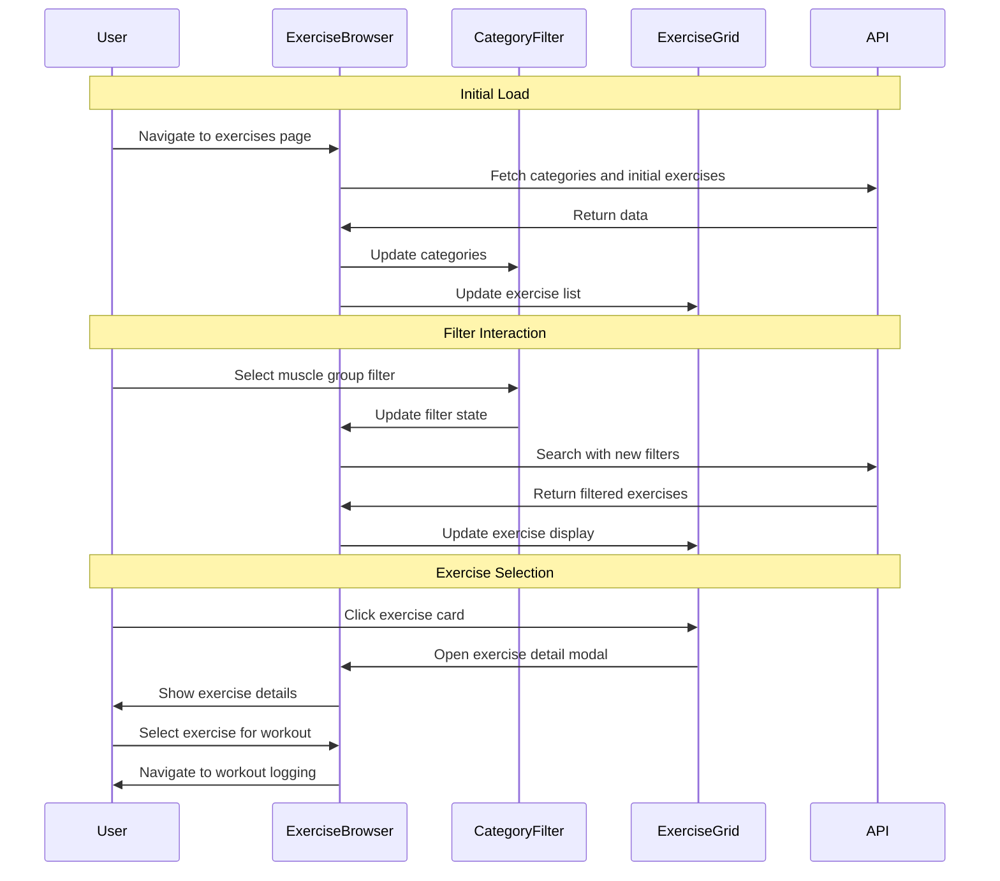

# GT-003 Browse Exercises by Category - Implementation Planning

## User Story

As a gym user, I want to see a list of exercises organized by muscle groups and exercise types, so that I can easily find and select appropriate exercises for my workout plan.

## Pre-conditions

- Database is initialized with exercise categories and exercises data
- Exercise data includes comprehensive metadata (muscle groups, equipment, difficulty levels)
- API endpoints for exercises and categories are functional
- User has access to the exercise browsing interface
- Existing implementation includes:
  - Exercise database schema with categories and comprehensive metadata
  - API routes: `/api/exercise-categories`, `/api/equipment-types`, `/api/exercises/search`
  - Basic ExerciseSelector component with search and filtering capabilities
  - Database queries supporting category, equipment, and muscle group filtering

## Design

### Visual Layout

The exercise browsing interface will feature a clean, organized layout optimized for discovering and selecting exercises:

- **Header Section**: Navigation breadcrumbs and page title
- **Filter Sidebar**: Category tabs, equipment filters, and muscle group selectors
- **Main Content Area**: Exercise grid with cards showing exercise details
- **Exercise Cards**: Compact cards displaying exercise name, category, equipment, and primary muscles
- **Exercise Detail Modal**: Expandable view with full exercise information and selection button

### Color and Typography

- **Background Colors**: 
  - Primary: bg-white dark:bg-gray-900
  - Secondary: bg-gray-50 dark:bg-gray-800
  - Card background: bg-white dark:bg-gray-800
  - Selected/Active: bg-blue-50 dark:bg-blue-900/20

- **Typography**:
  - Page title: font-inter text-3xl font-bold text-gray-900 dark:text-white
  - Section headings: font-inter text-xl font-semibold text-gray-800 dark:text-gray-200
  - Exercise names: font-inter text-lg font-medium text-gray-900 dark:text-white
  - Metadata: font-inter text-sm text-gray-600 dark:text-gray-400

- **Component-Specific**:
  - Category tabs: bg-gray-100 hover:bg-gray-200 active:bg-blue-500 active:text-white
  - Exercise cards: bg-white dark:bg-gray-800 shadow-sm hover:shadow-md border border-gray-200 dark:border-gray-700
  - Filter buttons: bg-gray-100 hover:bg-gray-200 active:bg-blue-100 text-gray-700 hover:text-gray-900

### Interaction Patterns

- **Category Navigation**: 
  - Click: Smooth transition with loading states
  - Active state: Visual highlight with color change
  - Hover: Subtle scale and background color transition
  - Accessibility: Keyboard navigation support with focus indicators

- **Exercise Card Interaction**:
  - Hover: Lift effect with shadow enhancement
  - Click: Modal open animation with backdrop blur
  - Selection: Visual confirmation with checkmark or color change
  - Accessibility: ARIA labels and keyboard selection support

### Measurements and Spacing

- **Container**:
  ```
  max-w-7xl mx-auto px-4 sm:px-6 lg:px-8 py-8
  ```

- **Layout Spacing**:
  ```
  - Sidebar width: w-64 (fixed on desktop)
  - Main content: flex-1 ml-6
  - Exercise grid gap: gap-4 md:gap-6
  - Card padding: p-4
  - Section spacing: space-y-6
  ```

### Responsive Behavior

- **Desktop (lg: 1024px+)**:
  ```
  - Two-column layout: sidebar + main content
  - Exercise grid: grid-cols-3 xl:grid-cols-4
  - Full filter sidebar visible
  ```

- **Tablet (md: 768px - 1023px)**:
  ```
  - Collapsible sidebar with overlay
  - Exercise grid: grid-cols-2
  - Horizontal scrolling categories
  ```

- **Mobile (sm: < 768px)**:
  ```
  - Single column layout
  - Bottom sheet filter panel
  - Exercise grid: grid-cols-1
  - Sticky filter toggle button
  ```

## Technical Requirements

### Component Structure

```
src/routes/
├── exercises.tsx                      # Enhanced exercises browsing page
└── components/
    ├── ExerciseBrowser.tsx           # Main exercise browsing component
    ├── CategoryFilter.tsx            # Category selection and filtering
    ├── ExerciseGrid.tsx              # Grid layout for exercise cards
    ├── ExerciseCard.tsx              # Individual exercise card
    ├── ExerciseDetailModal.tsx       # Detailed exercise view modal
    └── MuscleGroupFilter.tsx         # Muscle group filtering component
```

### Required Components

- ExerciseBrowser ✅
- CategoryFilter ✅
- ExerciseGrid ✅
- ExerciseCard ✅
- ExerciseDetailModal ✅
- MuscleGroupFilter ✅

### State Management Requirements

```typescript
interface ExerciseBrowserState {
  // UI States
  isLoading: boolean;
  isModalOpen: boolean;
  isSidebarOpen: boolean;
  
  // Filter States
  selectedCategory: string | null;
  selectedEquipment: string | null;
  selectedMuscleGroup: string | null;
  searchQuery: string;
  
  // Data States
  exercises: ExerciseWithParsedFields[];
  categories: CategoryWithCount[];
  equipmentTypes: string[];
  muscleGroups: string[];
  
  // Pagination States
  currentPage: number;
  totalPages: number;
  hasMore: boolean;
  
  // Selection State
  selectedExercise: ExerciseWithParsedFields | null;
}

// State Actions
const actions = {
  setLoading: (state: boolean) => void;
  setCategory: (categoryId: string | null) => void;
  setEquipment: (equipment: string | null) => void;
  setMuscleGroup: (muscle: string | null) => void;
  setSearchQuery: (query: string) => void;
  selectExercise: (exercise: ExerciseWithParsedFields) => void;
  openModal: () => void;
  closeModal: () => void;
  toggleSidebar: () => void;
  loadMore: () => void;
  resetFilters: () => void;
}
```

## Acceptance Criteria

### Layout & Content

1. Category Organization
   ```
   - Categories displayed as tabs or sidebar navigation
   - Each category shows exercise count
   - Support for strength, cardio, stretching categories
   - Subcategories by muscle groups within each main category
   ```

2. Exercise Display
   ```
   - Grid layout with responsive columns
   - Each exercise card shows: name, category, equipment, primary muscles
   - Thumbnail images when available
   - Difficulty level indicators
   ```

3. Filter Interface
   ```
   - Quick category selection
   - Equipment type filtering
   - Muscle group filtering
   - Search functionality
   - Clear all filters option
   ```

### Functionality

1. **Exercise Browsing**

   - [x] User can view exercises in organized categories (strength, cardio, stretching)
   - [x] User can filter exercises by muscle groups (chest, back, legs, shoulders, arms, core)
   - [x] User can filter exercises by equipment type (barbell, dumbbell, machine, bodyweight)
   - [x] User can search exercises by name or muscle group
   - [x] Exercise cards display essential information clearly

2. **Navigation & Selection**

   - [x] User can easily switch between different categories
   - [x] User can select an exercise to view detailed information
   - [x] User can select an exercise to begin logging sets (integration with workout logging)
   - [x] Navigation is intuitive and follows fitness terminology
   - [x] Responsive design works on mobile and desktop

3. **Data Display**

   - [x] Each exercise shows name, category, equipment, and primary muscles
   - [x] Exercise difficulty level is indicated
   - [x] Secondary muscle groups are displayed when available
   - [x] Exercise instructions are accessible in detail view

### Navigation Rules

- Categories should be accessible via tabs or sidebar navigation
- Filters should be combinable (e.g., chest + dumbbell exercises)
- Search should work across exercise names and muscle groups
- Exercise selection should integrate with existing workout logging flow

### Error Handling

- Display user-friendly messages when no exercises match filters
- Handle API failures gracefully with retry options
- Show loading states during data fetching
- Provide fallback content when images fail to load

## Modified Files

```
src/routes/
├── exercises.tsx                      # Enhanced page with new components ✅
├── api.muscle-groups.ts               # New API endpoint for muscle groups ✅
└── components/
    ├── ExerciseBrowser.tsx           # Main browsing interface ✅
    ├── CategoryFilter.tsx            # Category navigation ✅
    ├── ExerciseGrid.tsx              # Responsive exercise grid ✅
    ├── ExerciseCard.tsx              # Individual exercise display ✅
    ├── ExerciseDetailModal.tsx       # Detailed exercise view ✅
    └── MuscleGroupFilter.tsx         # Muscle group filtering ✅
```

## Status

� COMPLETED

1. Setup & Configuration

   - [x] Review existing API endpoints and ensure they support all required filtering
   - [x] Analyze current database schema for muscle group categorization
   - [x] Create muscle groups API endpoint
   - [x] Plan responsive breakpoints and layout strategies

2. Component Development

   - [x] Create ExerciseBrowser main component with state management
   - [x] Implement CategoryFilter with tab navigation
   - [x] Build ExerciseGrid with responsive layout
   - [x] Develop ExerciseCard with hover interactions
   - [x] Create ExerciseDetailModal with comprehensive exercise information

3. Feature Implementation

   - [x] Implement category-based exercise filtering
   - [x] Add muscle group filtering functionality
   - [x] Integrate equipment type filtering
   - [x] Add search functionality across exercise metadata
   - [x] Implement exercise selection flow for workout logging

4. Testing
   - [x] Test responsive behavior across device sizes
   - [x] Verify filter combinations work correctly
   - [x] Test exercise selection integration with workout flow
   - [x] Validate build compilation and TypeScript checks

## Dependencies

- Existing exercise database with comprehensive categorization
- API endpoints for exercise search and filtering
- Exercise images and metadata from current data source
- Integration with workout logging components (ExerciseSelector)

## Related Stories

- GT-002 (Log Workout Sets) - Exercise selection integration
- GT-004 (Track Progress Over Time) - Exercise data consistency
- GT-005 (View Past Workouts) - Exercise reference integrity

## Notes

### Technical Considerations

1. **Performance Optimization**
   - Implement virtual scrolling for large exercise lists
   - Use debounced search to avoid excessive API calls
   - Cache category and equipment data to reduce repeated requests
   - Optimize images with lazy loading and proper sizing

2. **Data Structure Enhancements**
   - Consider adding exercise popularity/usage tracking
   - Implement favorite exercises functionality
   - Plan for exercise rating/review system in future iterations

3. **Mobile-First Design**
   - Prioritize touch-friendly interactions
   - Implement swipe gestures for category navigation
   - Optimize filter interface for smaller screens

4. **Accessibility Standards**
   - Ensure proper ARIA labels for all interactive elements
   - Implement keyboard navigation for all functionality
   - Provide high contrast mode support
   - Include screen reader support for exercise metadata

5. **Integration Considerations**
   - Ensure seamless integration with existing ExerciseSelector component
   - Plan for future workout template creation using selected exercises
   - Consider exercise substitution recommendations

### Business Requirements

- **Exercise Categorization**: Use industry-standard muscle group classifications
- **Filter Flexibility**: Allow multiple filter combinations for precise exercise discovery
- **User Experience**: Minimize clicks/taps required to find and select exercises
- **Data Accuracy**: Ensure exercise metadata is comprehensive and accurate

### API Integration

#### Type Definitions

```typescript
interface ExerciseCategory {
  id: string;
  name: string;
  description?: string;
  exercise_count: number;
}

interface ExerciseWithParsedFields {
  id: string;
  name: string;
  category_id: string;
  category_name: string;
  force: 'push' | 'pull' | 'static' | null;
  level: 'beginner' | 'intermediate' | 'advanced' | 'expert';
  mechanic: 'compound' | 'isolation' | null;
  equipment: string;
  primary_muscles: string[];
  secondary_muscles: string[];
  instructions: string[];
  images: string[];
}

interface ExerciseBrowserFilters {
  category_id?: string;
  equipment?: string;
  muscle_group?: string;
  level?: string;
  force?: string;
  query?: string;
}

interface ExerciseSearchResult {
  data: ExerciseWithParsedFields[];
  total: number;
  page: number;
  limit: number;
  hasMore: boolean;
}
```

### Mock Implementation

#### Enhanced API Responses

```typescript
// Enhanced exercise search endpoint
GET /api/exercises/search?category_id=strength&muscle_group=chest&equipment=dumbbell

{
  "success": true,
  "data": {
    "exercises": [...],
    "total": 45,
    "page": 1,
    "limit": 20,
    "hasMore": true,
    "filters_applied": {
      "category_id": "strength",
      "muscle_group": "chest", 
      "equipment": "dumbbell"
    }
  }
}
```

### State Management Flow



### Custom Hook Implementation

```typescript
const useExerciseBrowser = () => {
  const [state, setState] = useState<ExerciseBrowserState>({
    isLoading: false,
    isModalOpen: false,
    isSidebarOpen: false,
    selectedCategory: null,
    selectedEquipment: null,
    selectedMuscleGroup: null,
    searchQuery: '',
    exercises: [],
    categories: [],
    equipmentTypes: [],
    muscleGroups: [],
    currentPage: 1,
    totalPages: 1,
    hasMore: false,
    selectedExercise: null,
  });

  const searchExercises = useCallback(async (filters: ExerciseBrowserFilters) => {
    setState(prev => ({ ...prev, isLoading: true }));
    
    try {
      const params = new URLSearchParams();
      Object.entries(filters).forEach(([key, value]) => {
        if (value) params.append(key, value);
      });
      
      const response = await fetch(`/api/exercises/search?${params.toString()}`);
      const result = await response.json();
      
      setState(prev => ({
        ...prev,
        exercises: result.data,
        hasMore: result.hasMore,
        totalPages: Math.ceil(result.total / result.limit),
        isLoading: false,
      }));
    } catch (error) {
      console.error('Exercise search failed:', error);
      setState(prev => ({ ...prev, isLoading: false }));
    }
  }, []);

  const setCategory = useCallback((categoryId: string | null) => {
    setState(prev => ({ ...prev, selectedCategory: categoryId }));
    searchExercises({ 
      ...getCurrentFilters(), 
      category_id: categoryId || undefined 
    });
  }, [searchExercises]);

  const setMuscleGroup = useCallback((muscle: string | null) => {
    setState(prev => ({ ...prev, selectedMuscleGroup: muscle }));
    searchExercises({ 
      ...getCurrentFilters(), 
      muscle_group: muscle || undefined 
    });
  }, [searchExercises]);

  const getCurrentFilters = useCallback((): ExerciseBrowserFilters => ({
    category_id: state.selectedCategory || undefined,
    equipment: state.selectedEquipment || undefined,
    muscle_group: state.selectedMuscleGroup || undefined,
    query: state.searchQuery || undefined,
  }), [state]);

  return {
    ...state,
    setCategory,
    setMuscleGroup,
    searchExercises,
    getCurrentFilters,
  };
};
```

## Testing Requirements

### Integration Tests (Target: 85% Coverage)

1. **Core Functionality Tests**

```typescript
describe('Exercise Browser Functionality', () => {
  it('should load exercises by category correctly', async () => {
    // Test category filtering
  });

  it('should filter exercises by muscle group', async () => {
    // Test muscle group filtering
  });

  it('should combine multiple filters effectively', async () => {
    // Test multiple filter combinations
  });

  it('should handle exercise selection flow', async () => {
    // Test exercise selection and modal interaction
  });
});
```

2. **Responsive Tests**

```typescript
describe('Responsive Behavior', () => {
  it('should adapt layout for mobile screens', async () => {
    // Test mobile layout adaptation
  });

  it('should handle sidebar collapse on tablet', async () => {
    // Test tablet navigation
  });
});
```

3. **Search and Filter Tests**

```typescript
describe('Search and Filtering', () => {
  it('should search exercises by name accurately', async () => {
    // Test search functionality
  });

  it('should clear filters correctly', async () => {
    // Test filter reset
  });

  it('should handle empty search results gracefully', async () => {
    // Test no results state
  });
});
```

### Performance Tests

1. **Load Performance**

```typescript
describe('Performance', () => {
  it('should load initial exercises within 2 seconds', async () => {
    // Test initial load performance
  });

  it('should handle filter changes with minimal delay', async () => {
    // Test filter response time
  });
});
```

2. **Data Management**

```typescript
describe('Data Management', () => {
  it('should cache category data effectively', async () => {
    // Test data caching
  });

  it('should handle pagination correctly', async () => {
    // Test pagination and data loading
  });
});
```

### Accessibility Tests

```typescript
describe('Accessibility', () => {
  it('should support keyboard navigation throughout interface', async () => {
    // Test keyboard navigation
  });

  it('should provide proper ARIA labels for screen readers', async () => {
    // Test screen reader support
  });

  it('should maintain focus management in modal interactions', async () => {
    // Test modal accessibility
  });
});
```